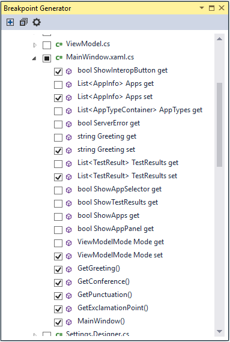

# Breakpoint Generator

<!-- Update the VS Gallery link after you upload the VSIX-->
Download this extension from the [VS Marketplace](https://marketplace.visualstudio.com/items?itemName=AndrewBHall-MSFT.BreakpointGenerator).

---------------------------------------

This extension enables you to generate breakpoints (and TracePoints) for any public method in your application.  This quickly allows you to learn the execution flow of new code bases and add debug time logging to your applications without the need to modify the source code.

> The extension only supports C# projects.

See the [change log](CHANGELOG.md) for changes and road map.

## Using the extension

Once you download and install the tool, a new menu item "Generate Breakpoints" will appear under the Debug menu

You can then choose which projects, files, and methods to create breakpoints for

The tool will by default generate TracePoints but can be configured to use a different default message or create breakpoints instead. 

More information can be found in the [blog post announcing the tool](http://blogs.msdn.com/b/visualstudioalm/archive/2015/11/19/breakpoint-generator-extension.aspx).

## Contribute
Check out the [contribution guidelines](CONTRIBUTING.md)
if you want to contribute to this project.

## License
MIT